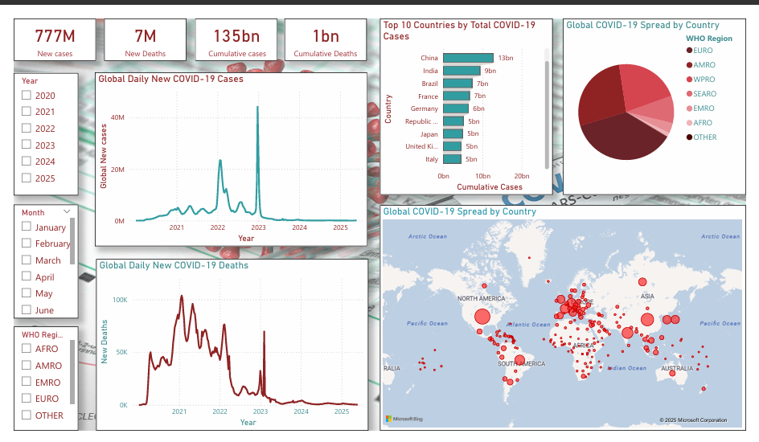

#  COVID-19 Data Analysis & Power BI Dashboard

This project analyzes global COVID-19 data using Python and Power BI. It focuses on identifying trends in new cases and deaths, most affected countries, and regional differences using data from the World Health Organization (WHO).

---

## 📊 What’s Included

- ✅ Data cleaning and exploration using Python (Jupyter Notebook)
- ✅ Visualizations of trends, regions, and country-wise impact
- ✅ Power BI dashboard for interactive reporting
- ✅ Key insights based on the global pandemic timeline

---

## 📁 Files in This Project

- `WHO-COVID-19-global-data` – COVID-19 dataset
- `WHO_COVID19_cleaned.csv` – Cleaned COVID-19 dataset
- `Cleaning.ipynb` – Python data cleaning notebook
- `EDA.ipynb` – Python EDA notebook
- `COVID19_Cases_Dashboard.pbix` – Power BI dashboard
- `images/dashboard_view.png` – Screenshot of the dashboard
- `README.md` – Project overview

---

## 📈 Key Insights

- The **USA, India, and Brazil** have the highest total COVID-19 cases.
- The **Americas region** reported the most cases across the pandemic.
- Multiple waves of infection are visible globally.
- Different WHO regions show varied patterns in case trends and containment.

---

## 📸 Power BI Dashboard Preview

---

## 💻 Tools Used

- **Python** (Pandas, Seaborn, Plotly)
- **Power BI Desktop**
- **Jupyter Notebook**
- **Data Source**: [WHO COVID-19 Data](https://covid19.who.int/data)

---

## 👩‍💼 About Me

**Jyothilakshmi m B**  
📫 [LinkedIn](https://www.linkedin.com/in/jyothilakshmi--mb)  
💼 Data Analyst | Python & Power BI Enthusiast

---

⭐ *If you found this project helpful, please star the repo!*
